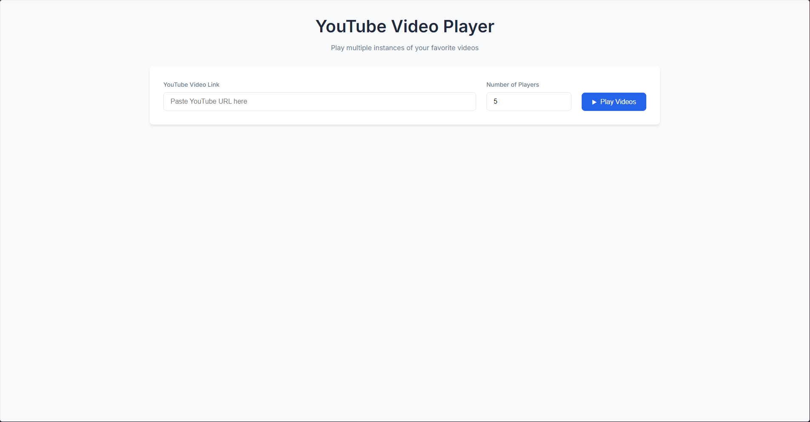
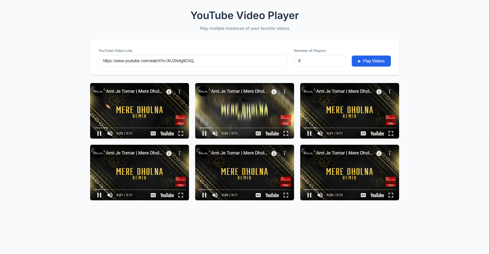

# YouTube Video Player

This project is a web application that allows users to play multiple instances of a YouTube video at the same time. Users can specify the YouTube video link and the number of players they want, and the application will display the specified number of video players for that link.




## Features

- **YouTube Video Link Input**: Users can paste a YouTube video link into the provided input field.
- **Multiple Video Players**: Users can specify how many instances of the video they want to play simultaneously.
- **User-Friendly Interface**: Simple and clean UI for easy interaction.

## How to Use

1. Open the application.
2. Paste a YouTube video link into the "YouTube Video Link" input field.
3. Specify the number of players using the input box labeled "Number of Players."
4. Click on the "Play Videos" button to see multiple players with the chosen video.

## Installation

To run the application locally, follow these steps:

1. Clone this repository:
   ```bash
   git clone <repository-url>
   ```

2. Start your XAMPP server and ensure Apache is running.

3. Place the project files in the appropriate directory (e.g., `htdocs` for XAMPP).

4. Open your browser and navigate to `http://localhost/youtube-video-player` to use the application.

## Project Structure

```
├── index.php 
├── css/
│   └── styles.css
└── js/
    └── player.js
```

- **index.php**: Main server-side script used for loading and handling video player logic.
- **css/styles.css**: Contains the styles used for the user interface.
- **js/player.js**: Contains JavaScript code to handle video playback.

## Dependencies

- **YouTube IFrame API**: Used to embed and control YouTube video playback.

## License

This project is open source and available under the [MIT License](LICENSE).

## Contributing

Contributions are welcome! If you have any ideas or suggestions, feel free to open an issue or submit a pull request.

## Contact

If you have any questions or issues, feel free to reach out:

- **Email**: [your-email@example.com](mailto:sbxp1966@gmail.com)
- **GitHub**: [Your GitHub Profile](https://github.com/arpan8925)

---
Thank you for checking out this project! Feel free to clone, fork, and contribute as you see fit.
